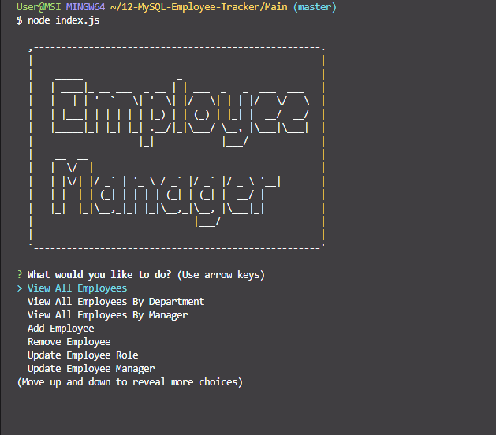
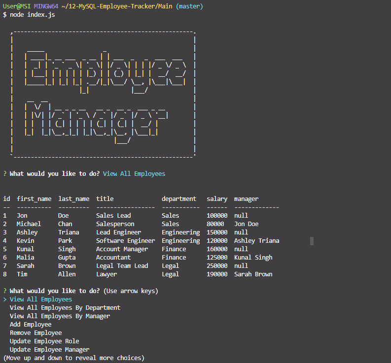
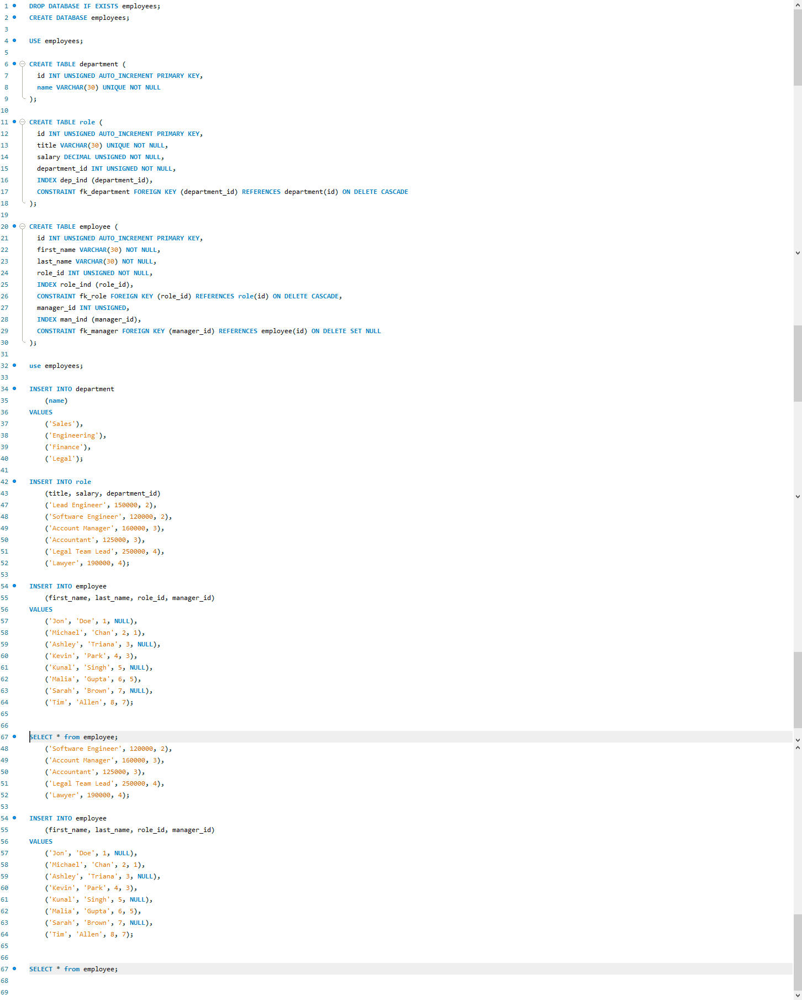

# Screenshots:

1. GIF of Entire App
   
2. Screenshot of App 1
   
3. Screenshot of App 2
   
4. Screenshot of App 3
   

# Main files:

- "Main/db/connection.js"
- "Main/db/index.js"
- "Main/db/schema.sql"
- "Main/db/seed.sql"

## Major Elements

Multiple moving parts in this assignment.

1. Requires a program like MySQL to establish server
2. Uses localhost:3306 on MySQL

### Installation and Setup

- Run 'npm i' before install
- Port is set to 3306 on MySQL and 3001 on client side
- After running 'node server.js', program uses inquirer to give user options

© Tony Park 2021
